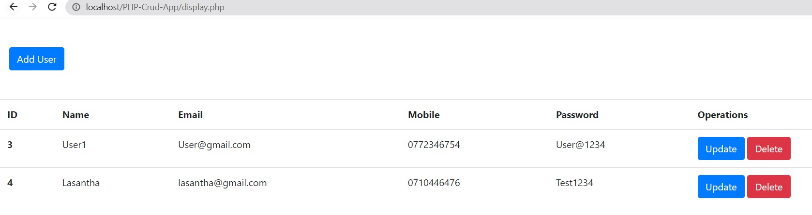
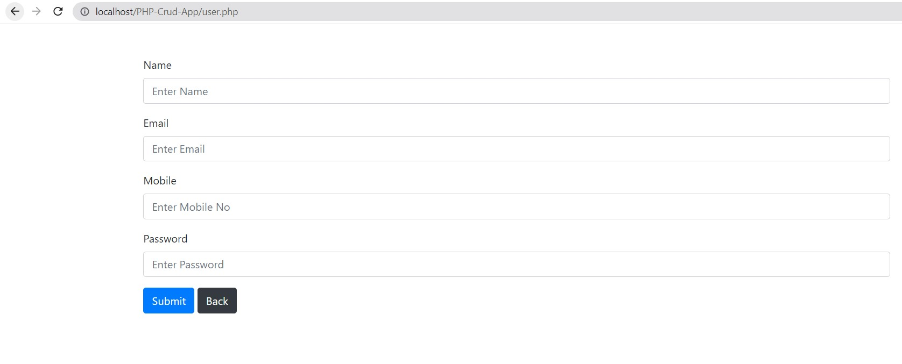
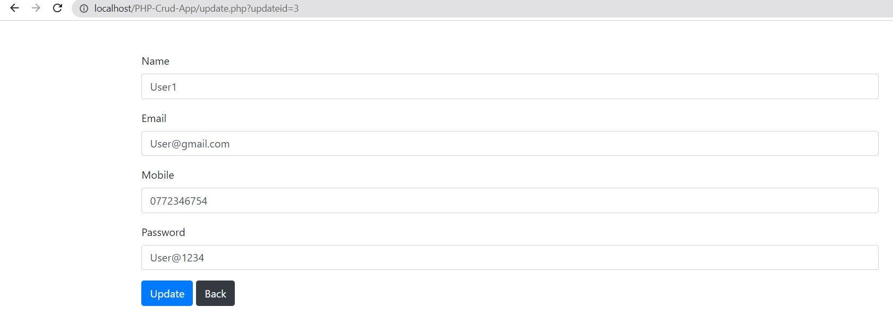
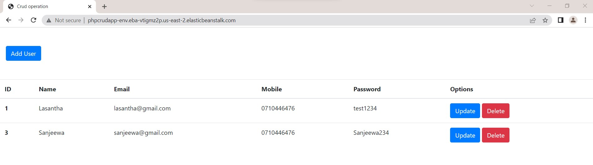

# Deploy PHP App to ElasticBeanstalk & AWS CodeDeploy and AWS CodePipeline. Use AWS RDS as Database.

## MySQL query for create table
```sh
create table crud(id INT AUTO_INCREMENT,name VARCHAR(100),email VARCHAR(100),mobile VARCHAR(20),password VARCHAR(20),PRIMARY KEY (id));
  ```

### Home Page


### Add User Page


### Update User Page


### After deploy AWS Elastic Benastalk


### Command for connect RDS MySQL Database locally
```sh
mysql -h {{Endpoint}} -u {{Username}} -p {{Password}}
  ```